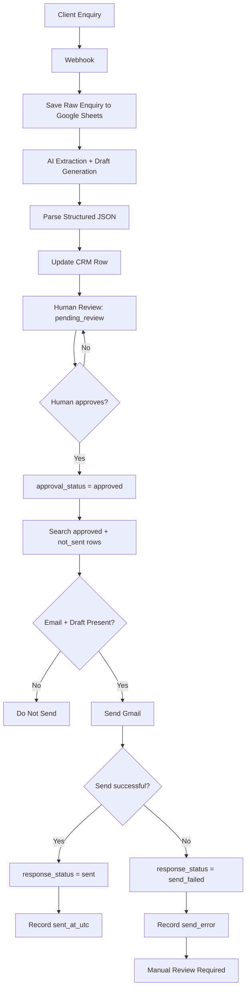

# AI Client Intake & Human-Approved Follow-up System

## Overview

This project is a portfolio automation system designed to demonstrate how AI, workflow automation, structured data, and human approval can work together in a safe client-intake process.

The system receives a client enquiry, stores the original data, uses AI to extract key information and prepare a response draft, places the result into a human-review queue, and only sends the email after explicit manual approval.

The main design principle is simple:

**AI can prepare the decision, but it cannot make or execute the final client-facing decision without human approval.**

---

## Problem

A business receiving project enquiries manually may need to:

- copy customer information into a CRM or spreadsheet,
- identify budget and timeline information,
- determine what information is missing,
- prepare a reply,
- review the reply,
- send the email,
- update the enquiry status,
- and track failures.

Doing this manually for every enquiry creates repetitive work and increases the risk of inconsistent responses or missed follow-ups.

This project explores how that process can be automated while keeping a human in control of outbound communication.

---

## Solution

I designed a two-stage Make.com workflow.

### Stage 1 — AI Client Intake

`Webhook → Google Sheets → AI Analysis → JSON Parsing → Google Sheets Update`

The system:

1. receives `lead_id`, `name`, `email`, and `message`,
2. immediately stores the original enquiry in Google Sheets,
3. sends the message to an AI agent,
4. extracts structured budget and timeline information,
5. identifies missing or unclear information,
6. generates a customer-facing email draft,
7. writes the result back to the original spreadsheet row,
8. sets the enquiry to `pending_review`.

No email is sent during this stage.

### Stage 2 — Human-Approved Email Sending

`Google Sheets → Approval Filter → Gmail → Status Update`

A reply can only be sent when:

- `approval_status = approved`
- `response_status = not_sent`
- an email address is present,
- an AI-generated draft is present.

After successful sending, the system sets `response_status = sent` and records the sending timestamp.

If Gmail sending fails, the system sets `response_status = send_failed` and records the failure for manual review.

---

## Architecture

This architecture deliberately separates AI preparation from outbound execution so that no customer-facing email can be sent without explicit human approval.

---

## Human-in-the-Loop Safety

The most important design decision in this project is the human approval gate.

The AI is allowed to:

- extract information,
- identify missing information,
- structure enquiry data,
- and prepare a response draft.

The AI is not allowed to:

- approve or reject a customer,
- decide business eligibility,
- assign a lead score without defined business rules,
- send an email directly,
- or bypass human review.

Every outbound response must be explicitly approved by a human first.

---

## Prompt Safety

Customer-provided fields are treated as untrusted data.

The AI system prompt explicitly prevents customer messages from changing system rules, output format, approval logic, recipient information, or workflow behaviour.

The AI is also instructed not to invent:

- prices,
- availability,
- eligibility criteria,
- delivery promises,
- project feasibility,
- or company policies that were not provided.

---

## Structured AI Output

The AI returns structured JSON containing fields such as:

- budget status,
- extracted project budget,
- timeline status,
- desired launch date,
- manual-review flag,
- review reason,
- and AI reply draft.

This output is parsed before being written into the CRM spreadsheet, using AI as a structured processing component rather than only a free-form text generator.

---

## CRM / Tracking Layer

Google Sheets is used as a lightweight CRM and audit layer.

The sheet tracks information including:

- `lead_id`
- `received_at_utc`
- `source`
- `name`
- `email`
- `message`
- `setup_budget_eur`
- `desired_launch_date`
- `qualification_status`
- `response_status`
- `notes`
- `ai_reply_draft`
- `approval_status`
- `approved_at_utc`
- `sent_at_utc`
- `send_error`

The schema also includes `lead_score` and `is_qualified`, but these are intentionally not automated in the current version.

No real business qualification criteria were provided, so allowing the AI to invent those rules would create an unreliable system.

---

## Error Handling

The outbound scenario contains a dedicated Gmail error-handling path.

If sending fails, the system:

1. does not mark the message as successfully sent,
2. changes the status to `send_failed`,
3. records an error message,
4. stops automatic retry for that row,
5. requires manual review before another sending attempt.

---

## End-to-End Test

The workflow was validated using controlled test data.

The successful test confirmed the complete process:

`Approved spreadsheet row → Gmail send → Email received → Spreadsheet updated to sent`

This verified that the human approval gate, Gmail integration, and status tracking work together correctly.

---

## Visual Evidence

Repository screenshots are stored in [`docs/screenshots/`](docs/screenshots/).

Planned evidence includes:

- V2 intake scenario overview,
- V3 human-approved outbound scenario,
- approval filter conditions,
- Google Sheets CRM review state,
- successful `sent` test row,
- optional received test email proof.

A screenshot capture and privacy checklist is available in [`docs/screenshots/README.md`](docs/screenshots/README.md).

> Screenshots must never expose webhook URLs, access tokens, API keys, OAuth details, private customer data, connection identifiers, or other credentials.

---

## Technology

- Make.com
- Google Sheets
- Gmail
- Webhooks
- AI agent / LLM processing
- Structured JSON output
- Conditional filters
- Human-in-the-loop approval
- Error handling
- Status tracking

---

## Skills Demonstrated

This project demonstrates practical experience with:

- workflow architecture,
- AI automation,
- prompt engineering,
- structured LLM output,
- API/webhook concepts,
- Google Workspace integrations,
- data mapping,
- conditional workflow logic,
- human-in-the-loop AI design,
- failure handling,
- CRM-style data structures,
- testing and debugging,
- and designing automation around a real business problem.

---

## Project Status

**Portfolio prototype completed.**

The automation was successfully tested end-to-end.

The Make.com scenarios are intentionally kept inactive outside demonstrations because this project was built as a portfolio prototype rather than a production client system.

---

## Possible Future Improvements

A production version could include:

- a real website or form integration,
- authenticated CRM access,
- defined business qualification rules,
- automatic lead scoring based on approved criteria,
- notifications for pending approvals,
- retry policies,
- dashboard reporting,
- duplicate-lead protection,
- and role-based review permissions.

These features were intentionally kept outside the current scope so the project could focus on the core AI-assisted intake and human-approved communication architecture.
